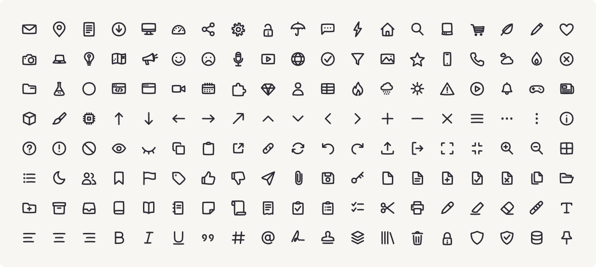

<div align="center">

# Doodle Icons ✏️

**152 hand-drawn icons that never sit still.**

Every stroke draws itself in, then keeps boiling like a Saturday-morning cartoon.

[**Play with them →** oreoui.com/doodle-icons](https://oreoui.com/doodle-icons)



</div>

## Install

```bash
npm i @oreoui/doodle-icons
```

Or skip the package entirely and grab the SVGs — [`icons/`](icons) for still
ones, [`icons-animated/`](icons-animated) for ones that draw themselves and
wiggle forever. They are plain files. They work anywhere an SVG works.

## Use

```jsx
import { DoodleIcon, BoilFilter } from '@oreoui/doodle-icons'

export default function App() {
  return (
    <>
      {/* mount once, anywhere — every icon on the page shares it */}
      <BoilFilter id="boil" />

      <DoodleIcon name="heart" boilId="boil" size={32} />
      <DoodleIcon name="star" boilId="boil" size={32} color="#f5a623" />

      {/* leave off boilId and the icon holds still */}
      <DoodleIcon name="check" size={32} />
    </>
  )
}
```

Strokes are `currentColor`, so colour comes from CSS like any other text:

```jsx
<span style={{ color: 'rebeccapurple' }}>
  <DoodleIcon name="bulb" boilId="boil" />
</span>
```

### Props

| Prop | Default | |
| --- | --- | --- |
| `name` | — | icon name, e.g. `"heart"` |
| `icon` | — | pass icon data directly instead of `name` |
| `size` | `24` | px, both axes |
| `strokeWidth` | `3.4` | the set is drawn for a chunky stroke |
| `boilId` | — | id of a mounted `<BoilFilter>`; omit to hold still |

Anything else is forwarded to the `<svg>`.

### `<BoilFilter>`

| Prop | Default | |
| --- | --- | --- |
| `id` | `"doodle-boil"` | referenced by `boilId` |
| `amplitude` | `1.6` | how far the ink wanders, in viewBox units |
| `duration` | `"0.55s"` | one full cycle of the wobble |

One filter serves the whole page — 200 boiling icons cost the same as one.

## The boil

The wiggle is not a video and not a sprite sheet. It is one SVG filter:
`feTurbulence` generates noise, `feDisplacementMap` pushes the ink around by
it, and a six-frame `<animate>` steps the noise seed on a loop.

Six discrete steps, not a smooth tween — the ink should *jump* between
drawings the way hand-inked animation does, rather than slide.

Because the filter works on rasterized pixels, it costs the same whether the
icon has one path or twenty.

## Without React

Every icon is also a file:

```html

```

One catch: an SVG loaded through `` is its own little document, so
`currentColor` cannot reach it from your page — the still icons render black.
Inline the SVG (or use the React component) if you need to recolour it.

The data is exported too, if you would rather render it yourself:

```js
import { ICONS, getIcon, ICON_NAMES, COLLECTIONS } from '@oreoui/doodle-icons'

getIcon('heart')  // { name: 'heart', paths: ['M 24 39 C …'] }
```

## What's here

- **152 icons**, stroke-only, in a 48×48 grid, drawn with a deliberately
  shaky hand. A new batch lands roughly every week
- **Two SVG builds** — still, and one that draws itself in and boils forever
- **React components** with tree-shaking, ESM + CJS + types
- **Zero runtime dependencies**. React is an optional peer

Icons are grouped into shelves — objects, communication, weather, media,
interface, files, text, arrows — see `COLLECTIONS`.

## Pro

A larger set with the same hand is in the works. It lives behind
[oreoui.com/doodle-icons](https://oreoui.com/doodle-icons) — everything in
*this* repo stays free and MIT forever.

## A note on the typeface

The site pairs these icons with
[Schoolbell](https://fonts.google.com/specimen/Schoolbell) by Font Diner,
which is not mine and is not included here. It is free under the SIL Open
Font License — grab it from Google Fonts.

## License

[MIT](LICENSE) — take the icons, take the wiggle, make something wobbly.

Built by [Nicole Tang](https://x.com/oreo_design) · part of
[Oreo UI](https://oreoui.com)
